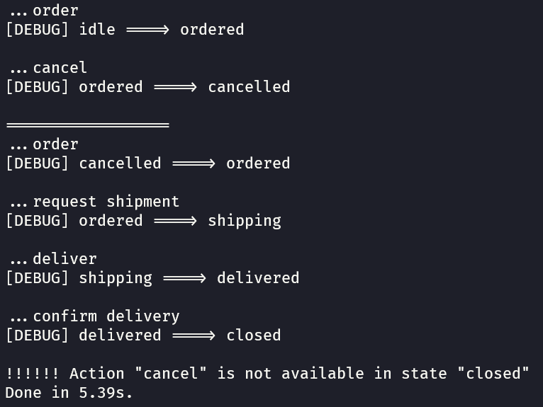
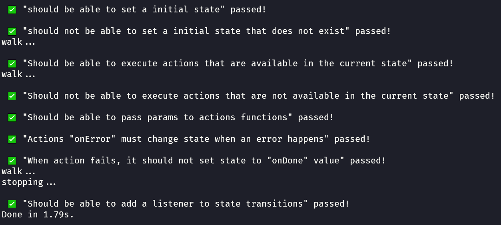

# State Machine

## Resumo

Repositório feito para registrar o meu estudo em relação aos "State Machines"

Uma state machine serve para gerenciar estados de uma forma mais previsível e explícita. Ou seja, você consegue definir quais ações a aplicação pode executar ou não em um determinado estado.

Por exemplo:

- Um produto no estado "idle" pode ser encomendado (ordered)

- Um produto no estado "ordered" pode ser cancelado, ou pode ser exportado (shipping)

- No entanto, um produto no estado "shipping" não pode mais ser cancelado, apenas enviado "delivered"

- O produto no estado "delivered" só pode executar a ação de confirmar o envio

- E, por fim, o produto no estado "cancelled" pode ser encomendado novamente

  

## Testes

Os testes foram feitos usando a ferramenta nativa do nodeJs: "assert"

Esse projeto foi feito com o método de desenvolvimento TDD (Test Driven Design):

